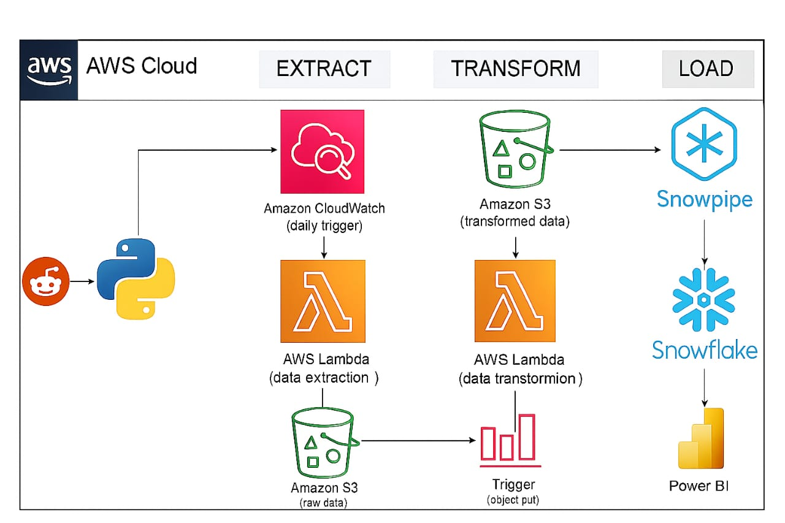

# Reddit End-to-End Data Engineering Project

## 📌 Introduction

This project demonstrates a complete end-to-end data engineering pipeline using Reddit's public API. It extracts meme-related posts from the `r/memes` subreddit, stores them in Amazon S3, processes and transforms the data using AWS Lambda, loads it into **Snowflake** via Snowpipe, and visualizes key metrics using **Power BI**. The pipeline uses fully serverless and cloud-native services for cost-effective and scalable data processing.

---

## 📊 Architecture



- **Extract**: A Lambda function is triggered daily by AWS CloudWatch. It fetches data from Reddit API and stores raw JSON in an S3 bucket.
- **Transform**: An object-created event in the S3 bucket triggers another Lambda function that cleans and transforms the data, writing the results to a `processed/` S3 path in CSV format.
- **Load**: Snowflake uses Snowpipe to automatically load newly transformed files from S3 into a queryable table. The stage, file format, and pipe are defined within Snowflake.
- **Visualize**: Power BI connects to the Snowflake table and presents insights via dashboards — including post counts, top authors, and daily trends.

---

## 🔍 About the API/Dataset

Using Reddit's `r/memes` subreddit, the pipeline fetches the top 10 hot posts per run and collects the following fields:

- Post ID
- Title
- Author
- Score (upvotes)
- Number of Comments
- Time of Creation
- Post URL

📚 **Reddit API Documentation**  
👉 [https://www.reddit.com/dev/api/](https://www.reddit.com/dev/api/)

---

## 🛠️ Cloud & BI Tools Used

### AWS Components
- **Lambda (Python)**: For extraction and transformation.
- **S3**: Stores both raw and transformed data.
- **CloudWatch**: Triggers the extract Lambda on a schedule.
- **S3 Trigger**: Invokes the transform Lambda on object creation.

### Snowflake Components
- **File Format**: Defines structure for ingesting CSV files.
- **External Stage**: Securely references S3 location.
- **Snowpipe**: Auto-ingests data from S3 into Snowflake.
- **Database/Table**: Holds structured Reddit data for querying.

### Power BI
- Connects to Snowflake using the built-in connector.
- Provides visual dashboards including:
  - 📈 **Post Trends Over Time**
  - 👤 **Top Authors by Score**
  - 💬 **Most Commented Posts**
  - 🧾 **Post Explorer (titles & metadata)**

---

## 📊 Power BI Dashboard

Here’s a snapshot of the final dashboard:

[Download PDF](Powerbi/Dashboard.pdf)

---

## Sample Snowflake Queries

```sql
-- Total number of posts
SELECT COUNT(*) FROM reddit.public.data;

-- Top 10 most upvoted posts
SELECT Title, Author, Score
FROM reddit.public.data
ORDER BY Score DESC
LIMIT 10;

-- Posts per day
SELECT DATE_TRUNC('DAY', Time_of_Creation) AS Post_Date, COUNT(*) AS Total_Posts
FROM reddit.public.data
GROUP BY Post_Date
ORDER BY Post_Date;
